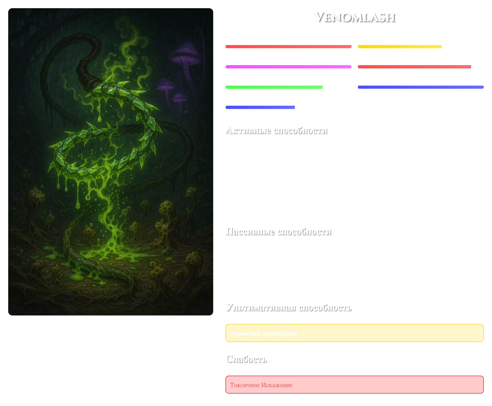

# 🎲 DnD Character Generator | Генератор персонажей DnD

[English](#english) | [Русский](#русский)

<h2 id="english">English</h2>

A modern web application for generating unique Dungeons & Dragons characters with beautiful visuals and detailed stats.

✨ Features

🎯 Random character generation with unique abilities
🌐 Bilingual support (English/Russian)
🎨 Beautiful character cards with stats visualization
💾 Downloadable character cards
📱 Responsive design
🎭 Multiple character (20) classes with unique abilities
📊 Detailed character statistics
🎨 Custom styling with styled-components

🚀 Getting Started

Prerequisites

Node.js (v14.0.0 or higher)
npm (v6.0.0 or higher)

Installation

1. Clone the repository:

git clone
cd dnd-character-generator

2. Install dependencies:

npm install

3. Start the development server:

npm start

The application will open in your default browser at `http://localhost:3000`.

🎮 Usage

1. Click the "Generate Character" button to create a new random character
2. View the character's stats, abilities, and weaknesses
3. Switch between English and Russian languages using the language toggle
4. Download the character card by clicking the "Download Image" button

🛠️ Built With

React.js Frontend framework
styled-components Styling
html2canvas Image generation
Context API State management

📁 Project Structure

    .
    ├── public
    │   ├── images          # Character images
    │   └── index.html
    ├── src
    │   ├── components      # React components
    │   ├── context         # Context providers
    │   ├── data           # Character data and stats
    │   └── App.js         # Main application component
    ├── package.json
    └── README.md

🙏 Acknowledgments

Character images and abilities inspired by Dungeons & Dragons
Special thanks to all contributors and users

---

<h2 id="русский">Русский</h2>

Современное веб-приложение для генерации уникальных персонажей Dungeons & Dragons с красивой визуализацией и детальной статистикой.

✨ Возможности

🎯 Случайная генерация персонажей с уникальными способностями
🌐 Поддержка двух языков (Английский/Русский)
🎨 Красивые карточки персонажей с визуализацией характеристик
💾 Возможность скачивания карточек персонажей
📱 Адаптивный дизайн
🎭 Множество классов персонажей (20) с уникальными способностями
📊 Детальная статистика персонажей
🎨 Кастомный стиль с использованием styled-components

🚀 Начало работы

Требования

Node.js (v14.0.0 или выше)
npm (v6.0.0 или выше)

Установка

1. Клонируйте репозиторий:

git clone
cd dnd-character-generator

2. Установите зависимости:

npm install

3. Запустите сервер разработки:

npm start

Приложение откроется в вашем браузере по умолчанию по адресу `http://localhost:3000`.

🎮 Использование

1. Нажмите кнопку "Сгенерировать персонажа" для создания нового случайного персонажа
2. Просмотрите характеристики, способности и слабости персонажа
3. Переключайтесь между английским и русским языками с помощью переключателя языка
4. Скачайте карточку персонажа, нажав кнопку "Скачать изображение"

🛠️ Технологии

React.js Фронтенд фреймворк
styled-components Стилизация
html2canvas Генерация изображений
Context API Управление состоянием

📁 Структура проекта

    .
    ├── public
    │   ├── images          # Изображения персонажей
    │   └── index.html
    ├── src
    │   ├── components      # React компоненты
    │   ├── context         # Провайдеры контекста
    │   ├── data           # Данные персонажей и характеристики
    │   └── App.js         # Главный компонент приложения
    ├── package.json
    └── README.md

🙏 Благодарности

Изображения персонажей и способности вдохновлены Dungeons & Dragons
Особая благодарность всем контрибьюторам и пользователям